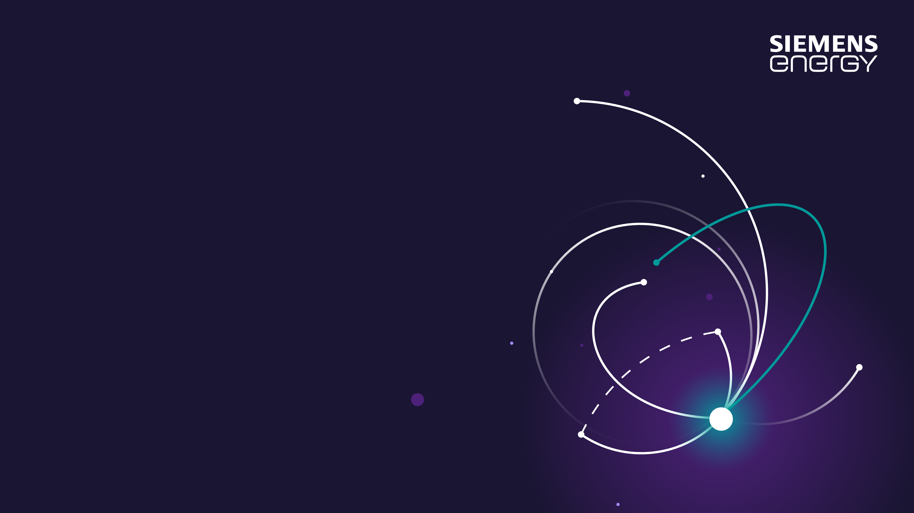

<!-- _class: cover -->

# Subject: Short Description of Your Topic

## Sub Title

<!-- _paginate: false -->

---

## Use ``##`` to define title in normal page

### h3 Title

#### h4 Title

**Bold Text**

Normal Text

*Italic Text*

~~Strike-through Text~~

**NOTE**: 

- h1 title can be used only in cover page
- at least **ONE** h2 title could be used in normal page


---

## Code

### In-line code

For instance `this is a code`

### code block

python code*:

``` python
print('hello world')
```

---

## Equation

### Inline equation

famous equation: $ E=m*C^2 $

### Equation

$$
D(x) = \begin{cases}
\lim\limits_{x \to 0} \frac{a^x}{b+c}, & x<3 \\
\pi, & x=3 \\
\int_a^{3b}x_{ij}+e^2 \mathrm{d}x,& x>3 \\
\end{cases} 
$$

---

## Table

|  Header   | Header  | Header |
|  ----  | ----  |--- |
| Cell  | Cell |Cell|
| Cell  | Cell |Cell|

---

## Picture




A paragraph to describe the picture.